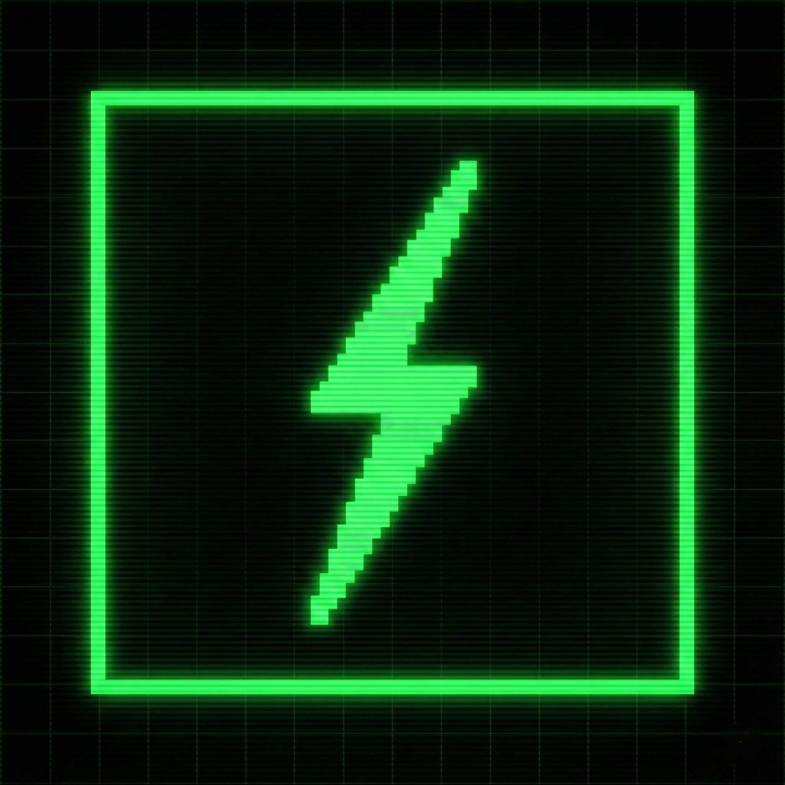
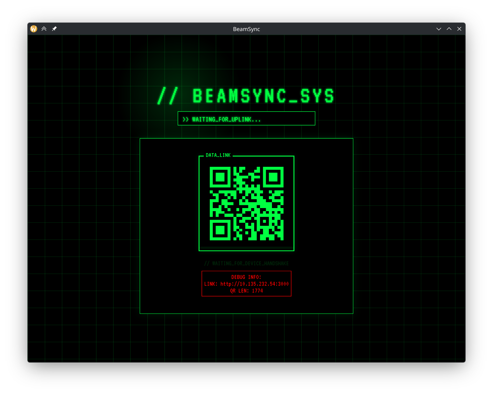
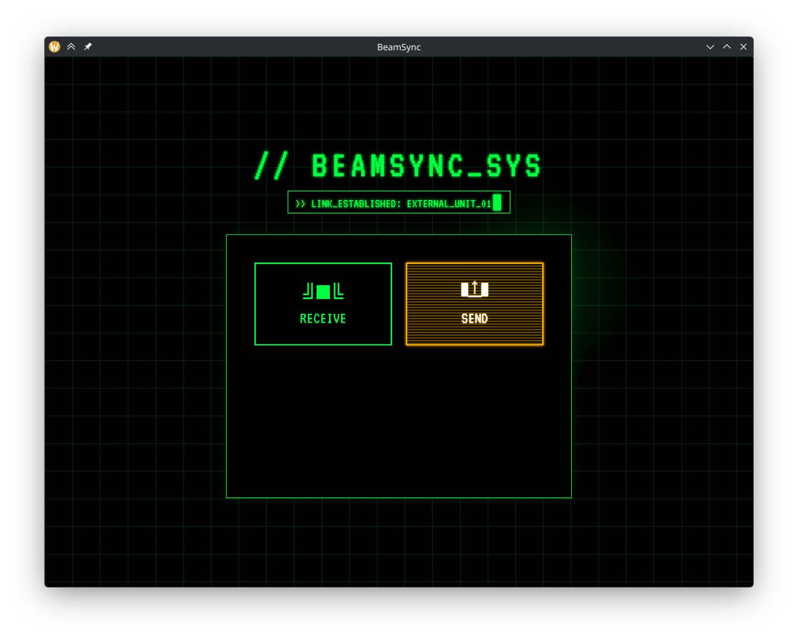

<div align="center">
  
</div>

# BeamSync

BeamSync is a fast, offline peer-to-peer file transfer application built with Go (Wails) and Svelte. It is designed to be robust, aesthetically pleasing, and easy to use.


<div align="center">
   <br>
  
</div>


## Features

- **Offline-First**: Transfer files directly over your local network (Wi-Fi/Ethernet) without internet access.
- **Smart IP Detection**: Automatically detects the preferred outbound IP address to ensure reliable connectivity.
- **Dynamic Port Scouting**: Automatically finds available ports (starting at 3000 for Receiver, 3005 for Sender) to avoid collisions with other applications or previous instances.
- **Resilient Backend**: Includes "zombie" process handling and safe event emission to prevent crashes.
- **Modern UI**: Features a Cyberpunk-inspired terminal interface (Svelte).

## Tech Stack

- **Frontend**: Svelte (Vite)
- **Backend**: Go (Wails v2)
- **Protocol**: HTTP/UDP (for discovery and transfer)

## Getting Started

### Prerequisites

- [Go](https://go.dev/) (1.18+)
- [Node.js](https://nodejs.org/) (npm)
- [Wails CLI](https://wails.io/)

### Installation

1. Clone the repository.
2. Navigate to the desktop directory:
   ```bash
   cd desktop
   ```
3. Install frontend dependencies:
   ```bash
   cd frontend && npm install && cd ..
   ```

### Running Development

To run the application in development mode (with hot reload):

```bash
wails dev
```

### Building for Production

To build the application for your OS:

```bash
wails build
```

The binary will be generated in `desktop/build/bin`.
