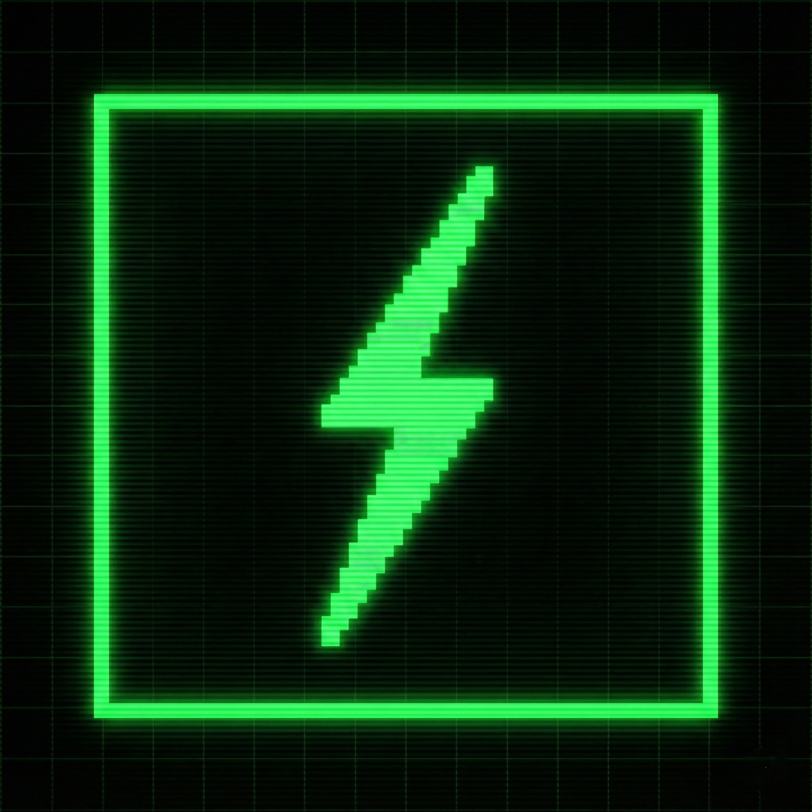
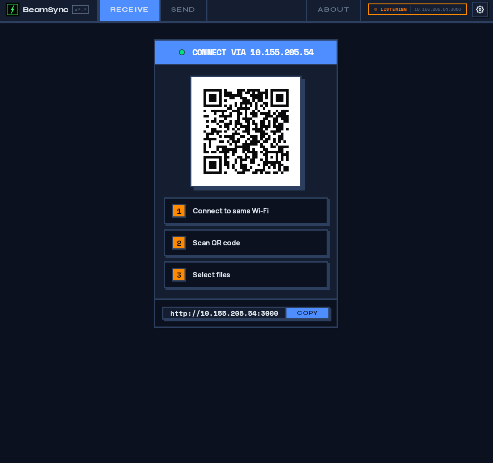
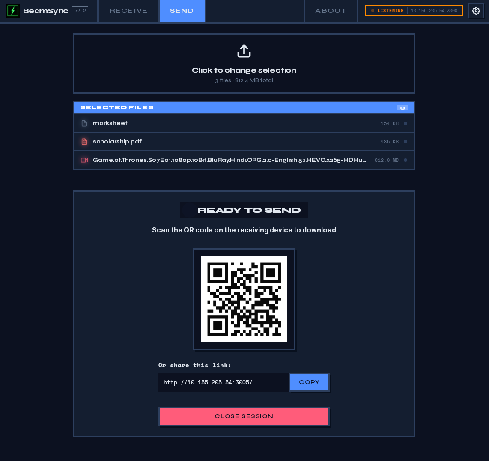
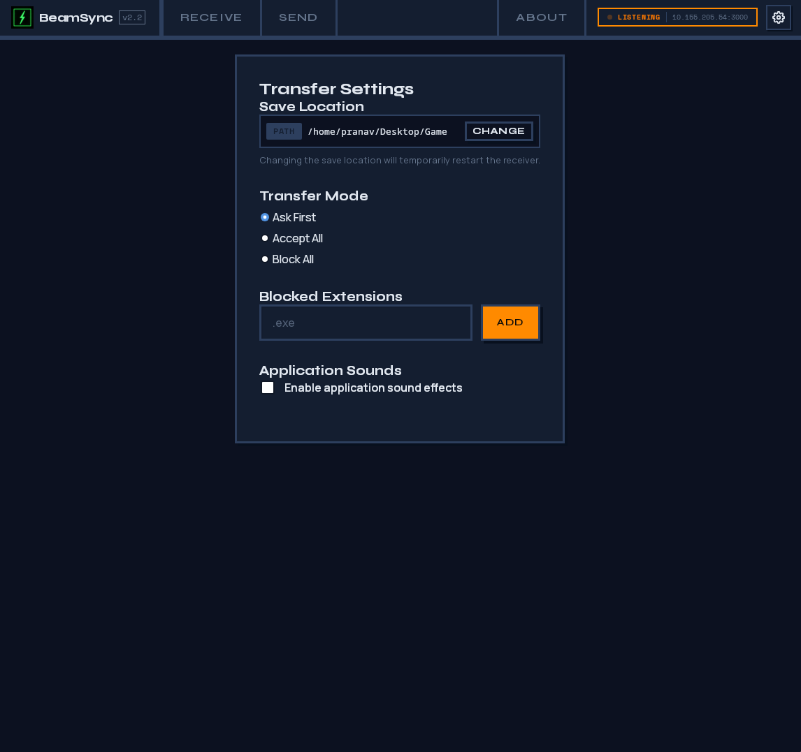

<div align="center">
  
  <h1>BeamSync</h1>
  <p>
    <b>Secure. Fast. Local.</b><br>
    A high-performance, offline-first peer-to-peer file transfer system.
  </p>

  <p>
    
    
    
    
    <br>
    <a href="LICENSE"></a>
    <a href="https://aur.archlinux.org/packages/beamsync-bin"></a>
  </p>
</div>

---

<details>
<summary>Table of Contents</summary>

- [Overview](#overview)
- [Features](#features)
- [Screenshots](#screenshots)
- [Architecture](#architecture)
- [Installation](#installation)
- [Building from Source](#building-from-source)
- [Usage Guide](#usage-guide)
- [API Documentation](API.md)
- [Security & Privacy](#security--privacy)
- [License](#license)
- [Contributing](#contributing)

</details>

## Overview

**BeamSync** is a cross-platform, desktop file transfer application engineered for speed and reliability. Built with **Go** ([Wails v2](https://wails.io/)) and **Svelte**, it establishes direct, high-bandwidth connections over your local area network — no internet required, no cloud involved, no accounts needed. Files go straight from one device to another.

## Features

- ⚡ **High-Speed Local Transfer** — Streams files directly over HTTP on your LAN for maximum throughput.
- 🔒 **Fully Offline** — Works without internet access. Data never leaves your local network.
- 📱 **Cross-Device via QR Code** — Connect any mobile device instantly by scanning a QR code — no app install required on the phone.
- 📂 **Drag & Drop** — Drop files onto the window to begin transfer immediately.
- 🧠 **Smart Networking** —
  - Auto-detects the optimal local IP address.
  - Finds open ports automatically to avoid conflicts.
  - Configures firewall rules on Linux when needed.
- 🔊 **Auditory Feedback** — Integrated audio engine provides real-time interaction sounds.
- ♿ **Accessible** — Respects `prefers-reduced-motion` for all animations.

## Screenshots

<div align="center">
  
</div>
<br>
<div align="center">
  
</div>
<br>
<div align="center">
  
</div>

## Architecture

The project is structured as a **Go workspace** with two modules:

```
BeamSync/
├── beamsync/          # Core library (Go module)
│   ├── server.go      # StartServer(), StartSender() — HTTP file streams
│   ├── port_manager.go# FindAvailablePort() — dynamic port binding
│   ├── firewall.go    # RunFirewallSetup() — Linux firewall automation
│   └── ...
├── desktop/           # Wails desktop application (Go + Svelte)
│   ├── app.go         # App lifecycle, config, event bridge
│   ├── frontend/      # Svelte + Vite UI
│   └── ...
└── go.work            # Go workspace root
```

| Layer | Technology | Key Components |
|-------|-----------|----------------|
| **Frontend** | Svelte + Vite | Reactive UI, drag-and-drop, QR display |
| **Application Shell** | Go + Wails v2 | `App` — event loop, config persistence (`loadConfig`, `saveConfig`) |
| **Network Engine** | Go (net/http) | `StartServer`, `StartSender`, `writeFileToDisk` — concurrent file I/O |
| **Utilities** | Go | `getLocalIP`, `FindAvailablePort`, `RunFirewallSetup` |
| **Media** | Go | `AudioEngine` — native audio playback |

> Architecture details derived from [graphify](graphify-out/GRAPH_REPORT.md) analysis: 172 nodes, 223 edges, 20 communities.

## Installation

### Arch Linux (AUR)

```bash
yay -S beamsync-bin
```

### Pre-built Binaries

Download the latest release from the [Releases](https://github.com/PranavAgarkar07/BeamSync/releases) page.

## Building from Source

### Prerequisites

- [Go](https://go.dev/) 1.25+
- [Node.js](https://nodejs.org/) (with npm)
- [Wails CLI](https://wails.io/)

### Steps

1. **Clone the repository:**
   ```bash
   git clone https://github.com/PranavAgarkar07/BeamSync.git
   cd BeamSync
   ```

2. **Install frontend dependencies:**
   ```bash
   cd desktop/frontend && npm install && cd ../..
   ```

3. **Run in development mode** (hot reload):
   ```bash
   cd desktop && wails dev
   ```

4. **Build for production:**
   ```bash
   cd desktop && wails build
   ```
   Compiled binaries are output to `desktop/build/bin/`.

## Usage Guide

### Receiving Files (Default Mode)

1. Launch BeamSync.
2. A connection QR code and URL are displayed automatically.
3. Scan the QR code from a mobile device, or open the URL from another machine on the network.
4. Incoming files are saved to `Downloads/BeamSync/`.

### Sending Files

1. Click **Send** or drag files onto the window.
2. Select the files to transfer.
3. A unique URL and QR code are generated.
4. Open the URL or scan the QR on the receiving device to start the download.

## Developer API

For developers, contributors, and security auditors who want to understand the underlying peer-to-peer file transfer protocol or build custom scripts/clients, the complete HTTP API and authentication specifications are available in the **[API Documentation (API.md)](API.md)**.

## Security & Privacy

- **Local-only** — All transfers happen over your LAN. No external servers are contacted.
- **Zero data collection** — BeamSync does not store, transmit, or analyze your files beyond the direct peer-to-peer transfer.
- **Open source** — The entire codebase is available for audit.

## License

This project is licensed under the **MIT License**. See the [LICENSE](LICENSE) file for details.

## Contributing

Contributions are welcome. Please open an issue or submit a pull request.
# TODO: 🐛 [bug] serverstate hybrid mutex/atomic pattern can cause false device disconnects (#86)
